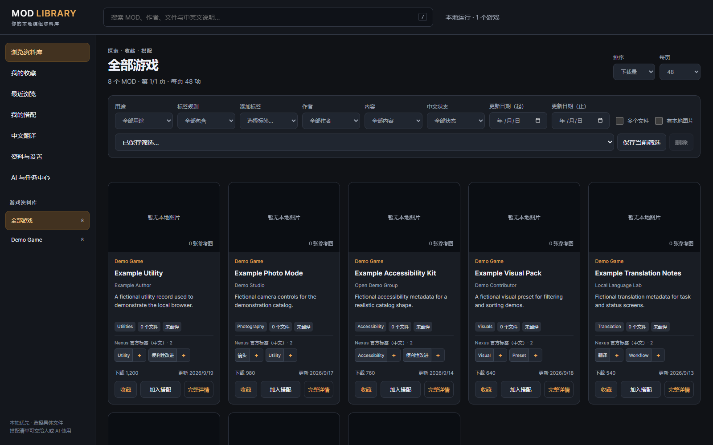
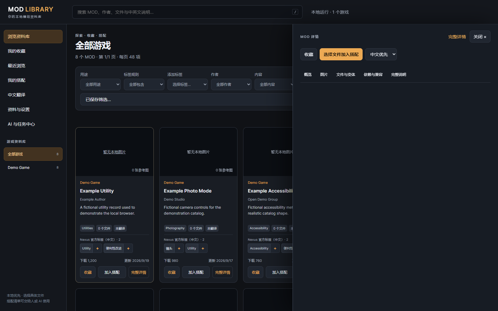
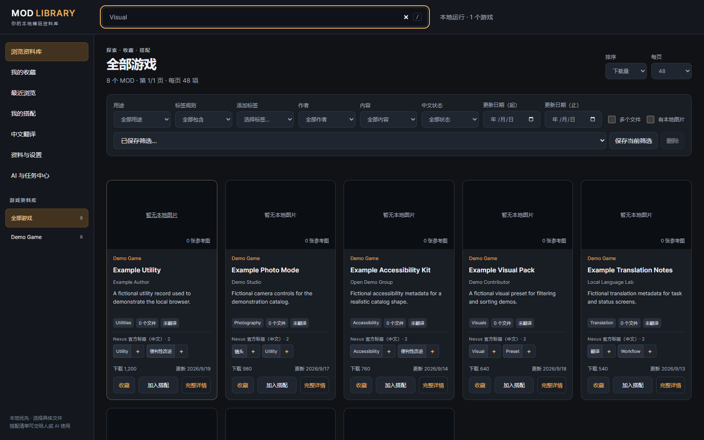
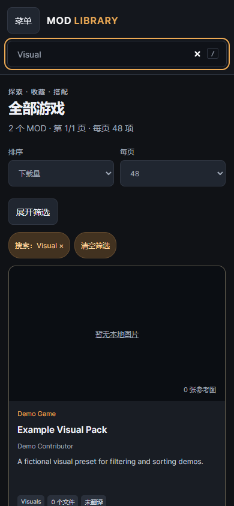
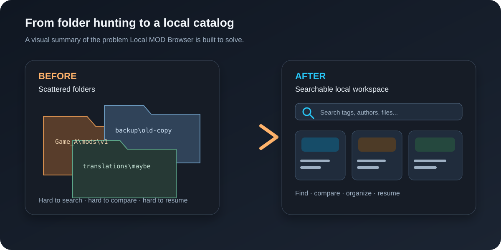

# Local MOD Browser

<p align="center"></p>


[](https://github.com/son-gladyso/Local-Mod-Browser/actions/workflows/ci.yml)

> **Your MOD library should not be a pile of folders you are afraid to touch.**
>
> Local MOD Browser turns scattered local metadata into a searchable, comparable,
> recoverable workspace that can safely cooperate with AI—without uploading your
> private inventory to a cloud service.

[Get started](#five-minute-quick-start) · [Download v2.5.2](https://github.com/son-gladyso/Local-Mod-Browser/releases/tag/v2.5.2) · [AI and CLI](#ai-and-cli) · [Security boundary](#privacy-and-security) · [Open an issue](https://github.com/son-gladyso/Local-Mod-Browser/issues)

## What it is

Local MOD Browser is a privacy-first Windows catalog browser, metadata workbench,
and local AI workflow platform. It indexes directories you provide and gives you
one place to search, filter, compare, annotate, translate, favorite, and maintain
your collection over time.

It is deliberately **not** a download site, installer, mod executor, or remote
hosting service. It helps you understand and maintain the files and metadata you
already own or are authorized to use.

```text
Your metadata → index and search → details / tags / file comparison → favorites
                                               ↓
                         revisions / translation jobs / resumable batches
                                               ↓
                         browser, CLI and MCP over one local API
```

## See the product before installing

These screenshots come from the repository's **eight fictional Demo records**.
They contain no real MOD, game asset, or third-party site data; they show the actual
public build after startup rather than a design mockup.









See the reproducible walkthrough in [`docs/demo-walkthrough.md`](docs/demo-walkthrough.md).



## Why people use it

### Find the right thing quickly

- Search across games and local sources with full-text search, pagination, combined
  tags, author/date filters, and translation state.
- Open a stable detail view with images, source links, author text, file lists, and
  revision history instead of hunting through folders again.
- Compare the exact file copies you are considering; never assume that a MOD name
  identifies one unique archive.

### Keep decisions and maintenance work visible

- Save favorites and import/exportable loadouts for rebuilds or machine migration.
- Review metadata changes through `preview` before applying them.
- Maintain long translations as validated segments with progress, quality checks,
  pause/resume, idempotent replay, and authoritative receipts.
- Let a second assistant continue a task through leases, renewal, handoff, and
  incremental event cursors.

### Give AI a proper interface

- Browser UI, CLI, and optional MCP adapter share one contract instead of requiring
  an assistant to guess at clicks.
- The contract currently exposes 70 operations for search, details, revisions,
  favorites, loadouts, translations, and task management.
- Stable idempotency keys and receipts make retries explainable after a timeout.
- The local API binds to `127.0.0.1` by default and does not call a general-purpose
  model or silently upload your data.

## At a glance

| Need | Built-in answer |
| --- | --- |
| Search several games and drives | Multiple local sources with one indexed search surface |
| Pick one exact archive | File-level comparison and explicit selection |
| Pause a long translation | Segments, leases, receipts, checkpoints, and recovery |
| Work with an AI assistant privately | Local HTTP, CLI, or MCP with one shared contract |
| Recover after an upgrade or crash | Paired backups, restore journal, version history, and stable identities |

## Privacy and security

- Only metadata supplied by you is indexed.
- The repository contains no private inventories, MOD archives, personal databases,
  backups, exports, runtime tokens, or third-party site snapshots.
- The service does not download, redistribute, install, or execute MOD files.
- The default listener is loopback-only; it is not designed as a LAN or public service.
- Runtime, database, diagnostics, exports, and test results are ignored by Git.
- Use any third-party source only within its terms, API policy, and content license.

Read the [security policy](SECURITY.md), [contribution guide](CONTRIBUTING.md), and
[third-party notices](THIRD_PARTY_NOTICES.md) before extending the project.

## Supported platform

- Windows 10/11 x64.
- Pinned runtime: CPython 3.13.15 x64 and SQLite 3.53.4.
- The first setup downloads and verifies the pinned runtime, using a system Python
  only to run the bootstrap script.
- Sources, checksums, and licenses are recorded in [`runtime-lock.json`](runtime-lock.json).
- Linux and macOS are not currently supported.

## Five-minute quick start

### 1. Clone and create a local source configuration

```powershell
git clone https://github.com/son-gladyso/Local-Mod-Browser.git
cd Local-Mod-Browser
New-Item -ItemType Directory -Force data | Out-Null
Copy-Item config\sources.example.json data\sources.json
```

### 2. Install the pinned runtime and launch

```powershell
python tools\bootstrap_runtime.py
.\.runtime\python.exe -X utf8 launcher.py --no-browser
```

You can also double-click `启动MOD浏览器.cmd`. The launcher prints a local URL.
The example configuration points at fictional demo metadata, so you can explore
the workflow without providing a private collection first.

If you prefer a direct download, use the [v2.5.2 Release](https://github.com/son-gladyso/Local-Mod-Browser/releases/tag/v2.5.2)
and download `Local-Mod-Browser-2.5.2-source.zip`. The accompanying
`SHA256SUMS.txt` lets you verify the archive.

### 3. Point it at your own metadata

Edit the Git-ignored `data\sources.json`:

```json
[
  {
    "key": "mygame",
    "title": "My Game",
    "root": "D:\\Mods\\My Game",
    "outputDir": "D:\\Mods\\My Game\\catalog"
  }
]
```

Put a `catalog-data.json` in each `outputDir`. Relative paths are resolved from
the directory containing `sources.json`. You can also set
`LOCAL_MOD_BROWSER_SOURCES` to another configuration file.

See [`config/sources.example.json`](config/sources.example.json) and the fictional
[`examples/demo-game/catalog-data.json`](examples/demo-game/catalog-data.json).

### 4. Check the local service

```powershell
.\.runtime\python.exe -X utf8 ai.py doctor
.\.runtime\python.exe -X utf8 ai.py capabilities
.\.runtime\python.exe -X utf8 ai.py games
```

Open `/api/docs` for the machine-readable contract and `/api/health` for runtime,
database, and service status.

## AI and CLI

The CLI is a stable entry point for scripts and assistants:

```powershell
.\.runtime\python.exe -X utf8 ai.py tour
.\.runtime\python.exe -X utf8 ai.py capabilities
.\.runtime\python.exe -X utf8 ai.py games
.\.runtime\python.exe -X utf8 ai.py doctor
```

For a safe workflow:

1. Read capabilities and the contract before choosing an operation.
2. Search and read resources before preparing a `preview`.
3. Verify IDs, versions, and diffs, then apply with a stable `idempotencyKey`.
4. Wait for real terminal states; do not treat `queued` as completed.
5. After interruption, check receipts and event cursors before retrying or handing off.

See [`docs/user-guide.md`](docs/user-guide.md),
[`docs/ai-platform-guide.md`](docs/ai-platform-guide.md), and
[`docs/architecture.md`](docs/architecture.md).

## Verification

The public repository keeps reproducible synthetic acceptance checks:

```powershell
.\.runtime\python.exe -X utf8 -m unittest discover -s tests -v
.\.runtime\python.exe -X utf8 tests\startup_acceptance.py
.\.runtime\python.exe -X utf8 tests\collaboration_acceptance.py
python -m pip install jsonschema==4.26.0
python -X utf8 tests\contract_audit.py --fixture
node --check static/app.js
node --check static/editor.js
node --check tests/browser.cjs
```

Browser acceptance additionally needs `npm install` and the Playwright browser.
Windows CI runs the pinned-runtime setup, Python regression, contract audit, and
JavaScript syntax checks.

## Project map

```text
server.py                    local HTTP service and error boundary
platform_api.py              70 platform operations and business rules
contracts.py                 shared HTTP/CLI/MCP contract and schemas
catalog.py                   source configuration, indexing, and projections
ai.py                        assistant-friendly CLI
mcp_adapter.py               optional local MCP entry point
static/                      browser interface
tests/                       regression, contract, startup, collaboration, soak checks
tools/bootstrap_runtime.py   pinned runtime installation and verification
docs/                        user, AI platform, and architecture guides
```

## Roadmap and contributing

See [`ROADMAP.md`](ROADMAP.md) for the current direction. Good first contributions
include documentation, reproducible tests, accessibility improvements, and small
source-configuration enhancements.

Please read [`CONTRIBUTING.md`](CONTRIBUTING.md) before opening a pull request.
Every external change is reviewed; CI, Code Owner approval, resolved conversations,
privacy checks, and focused tests are required before merging into `main`.

If this project solves a real problem for you, a Star or a concrete Issue helps other
people discover it. A small reproducible report is more valuable than a vague feature
request—and every accepted improvement stays reviewable in the public history.

## License

Project code is released under the [MIT License](LICENSE). See
[`THIRD_PARTY_NOTICES.md`](THIRD_PARTY_NOTICES.md) for pinned runtime and optional
dependency notices. The MIT license does not grant rights to MODs, game assets,
site data, author text, or other third-party content.
